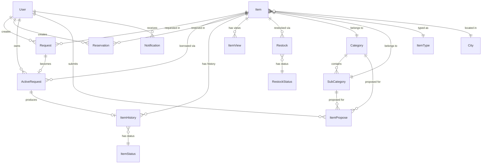

# Inventory Management System — Project Overview

## 1. Project Summary

This is a web-based **Inventory Management System** built with **ASP.NET Core MVC (.NET 8)**. The application enables an organization to:

- Manage inventory items (borrowable & consumable)
- Process borrow requests and reservations submitted by employees
- Track the full item lifecycle (request → approval → pickup → return)
- Monitor item history and audit logs of user activity
- Manage categories, sub-categories, and locations (cities)
- Allow employees to propose new items
- Send real-time notifications and emails
- Import/export data via CSV and Excel
- Display dashboard analytics with charts

---

## 2. Tech Stack

| Component | Technology |
|---|---|
| **Framework** | ASP.NET Core MVC (.NET 8) |
| **Database** | SQLite via Entity Framework Core 8 |
| **ORM** | Entity Framework Core (Code-First with Migrations) |
| **Authentication** | ASP.NET Identity + Google OAuth |
| **Authorization** | Role-based (Admin & Employee) |
| **Object Mapping** | AutoMapper 13 |
| **Validation** | FluentValidation 12 |
| **Logging** | log4net |
| **Real-time** | SignalR (Notification Hub) |
| **File Import** | CsvHelper 33, ExcelDataReader 3.7 |
| **QR Code** | QRCoder 1.6 |
| **Email** | SMTP (Gmail) |
| **Frontend** | Razor Views + JavaScript |

---

## 3. Solution Structure

The solution consists of **5 projects**, separated by concern:

```
InventoryManagementSystem.sln
├── InventoryManagementSystem/             ← Main Web App (MVC)
├── InventoryManagementSystem.Models/      ← Entity Models, Enums, DTOs
├── InventoryManagementSystem.Persistence/ ← DbContext, Migrations, Repositories
├── InventoryManagementSystem.Tests/       ← Unit Tests
└── InventoryManagementSystem.Utilities/   ← Helper/Utility classes
```

### Dependency Flow

```
Main App ──→ Models
Main App ──→ Persistence ──→ Models
Main App ──→ Utilities
Tests    ──→ All projects
```

---

## 4. Project: `InventoryManagementSystem.Models`

Contains all **entity models**, **enums**, and **DTOs** (Data Transfer Objects).

### 4.1. Entity Models (`Models/`)

| Entity | Description | Primary Key |
|---|---|---|
| `Item` | Core inventory item | `ItemId` (Guid) |
| `Category` | Item category (e.g., Electronics, Stationery) | `CategoryId` (Guid) |
| `SubCategory` | Sub-category under a category | `SubCategoryId` (Guid) |
| `ItemType` | Item type: Borrowable (1) or Consumable (2) | `Id` (int) |
| `City` | Location/city where the item resides | `CityId` (Guid) |
| `Request` | Borrow request submitted by an employee | `RequestId` (Guid) |
| `ActiveRequest` | An approved request that is currently active | `ActiveRequestId` (Guid) |
| `Reservation` | Item reservation for a specific date | `ReservationId` (Guid) |
| `ItemHistory` | Item status history after return | `ItemHistoryId` (Guid) |
| `ItemView` | Custom item view configuration | `ItemViewId` (Guid) |
| `ItemPropose` | New item proposal from an employee | `ItemProposeId` (Guid) |
| `ItemStatus` | Lookup table: WellReturned, Damaged, Lost, Consumed | `Id` (int) |
| `Restock` | Restock request for an item | `RestockId` (Guid) |
| `RestockStatus` | Restock status lookup | `Id` (int) |
| `Notification` | User notification | `NotificationId` (int) |
| `AuditLog` | Activity log for all users | `ActivityId` (Guid) |
| `User` | User (extends IdentityUser) | `Id` (string) |
| `ProposeLimit` | Maximum proposal limit for employees | — |
| `ChartView` | Dashboard chart configuration | `ChartViewId` |

### 4.2. `User` Entity

```csharp
public class User : IdentityUser
{
    string EmployeeCode    // Unique employee code
    string FirstName
    string LastName
    bool IsDeleted          // Soft delete flag
    string? ProfilePicturePath
    IEnumerable<Notification> Notifications
    ICollection<ItemPropose> ItemProposes
}
```

### 4.3. `Item` Entity — Core Entity

```csharp
public class Item
{
    Guid ItemId
    string ItemCode         // Unique code (auto-generated)
    string? ItemName
    string? Description
    DateTime CreateAt
    string? PicturePath     // Item photo
    bool Availability
    int? Quantity
    int? QuantityLow        // Threshold for restock alert
    bool IsDeleted          // Soft delete
    int TypeId              // 1=Borrowable, 2=Consumable
    Guid CategoryId
    Guid SubCategoryId
    Guid CityId

    // Navigation Properties
    → ItemType, Category, SubCategory, City
    → Collections: ItemViews, Requests, ActiveRequests, ItemHistories, Restocks, Reservations
}
```

### 4.4. Lifecycle Flow: Request → ActiveRequest → ItemHistory

```
Employee creates a Request
        ↓
Admin approves → ActiveRequest is created (status: WaitingPickUp)
        ↓
Employee picks up → status changes to InUser
        ↓
Employee returns → ItemHistory is created (status: WellReturned/Damaged/Lost/Consumed)
        ↓
ActiveRequest is closed (status: Returned)
```

### 4.5. Enums

| Enum | Values |
|---|---|
| `ItemTypeEnum` | All(0), Borrowable(1), Consumable(2) |
| `RequestStatusEnum` | WaitingApproval(0), Approved(1), Rejected(2), Returned(3) |
| `ActiveRequestStatusEnum` | WaitingPickUp(0), InUser(1), Late(2), Returned(3), Cancelled(4) |
| `ReservationStatusEnum` | WaitingApproval(0), Approved(1), Rejected(2), Cancelled(3) |
| `ProposeStatusEnum` | WaitingApproval(0), Approved(1), Rejected(2) |
| `ItemStatusEnum` | WellReturned(1), Damaged(2), Lost(3), Consumed(4) |
| `InputSourceEnum` | MainPage(1), DetailsPage(2) |

### 4.6. DTOs (`ModelsDTO/`)

DTOs are grouped by domain into sub-folders:

| DTO Folder | File Count | Purpose |
|---|---|---|
| `ActiveRequestDTOs/` | 11 | CRUD & filter active requests |
| `AuditLogDTOs/` | 2 | Display audit logs |
| `CategoryDTOs/` | 7 | CRUD categories |
| `ChartDTOs/` | 1 | Dashboard chart data |
| `ItemViewDTOs/` | 8 | CRUD item views |
| `ItemHistoryDTOs/` | 8 | Item history data |
| `ItemProposeDTOs/` | 12 | New item proposals |
| `NotificationDTOs/` | 3 | Notification data |
| `ProposeLimitDTOs/` | 1 | Proposal limit settings |
| `RequestDTOs/` | 9 | CRUD borrow requests |
| `ReservationDTOs/` | 4 | CRUD reservations |
| `SubCategoryDTOs/` | 10 | CRUD sub-categories |
| `UserViewDTOs/` | 6 | User management |

---

## 5. Project: `InventoryManagementSystem.Persistence`

Contains the **data access layer** using the Repository Pattern.

### 5.1. `ApplicationDbContext`

Inherits from `IdentityDbContext<User>` (ASP.NET Identity). Contains **18 DbSets**:

```
Items, Types, Categories, SubCategories, Cities, ItemViews,
ItemStatuses, RestockStatuses, Requests, ActiveRequests, ItemHistories,
Restocks, Notifications, Reservations, ItemProposes, ProposeLimit,
Auditlogs, ChartViews
```

Configuration uses **Fluent API** in `OnModelCreating()` to define:
- Primary keys, unique indexes (ItemCode, CategoryCode, SubCategoryCode, EmployeeCode, CityName)
- Foreign key relationships and cascade behaviors
- Default values and nullable properties

### 5.2. Database Seeding

- `IDbInitializer` / `DbInitializer` — Seeds initial data (roles, admin account, item types, item statuses, cities)
- `SeedDataService` — Endpoint to generate/clear dummy data via URL

### 5.3. Repositories (`Repository/`)

Uses a **Generic Repository Pattern** with the base class `Repository<T>`.

| Repository | Entity Handled |
|---|---|
| `Repository<T>` | Base generic (CRUD operations) |
| `ItemRepository` | Item |
| `CategoryRepository` | Category |
| `SubCategoryRepository` | SubCategory |
| `CityRepository` | City |
| `ItemViewRepository` | ItemView |
| `ItemTypeRepository` | ItemType |
| `ItemStatusRepository` | ItemStatus |
| `RequestRepository` | Request |
| `RequestAdminRepository` | Request (admin-specific queries) |
| `RequestEmployeeRepository` | Request (employee-specific queries) |
| `ActiveRequestRepository` | ActiveRequest |
| `ActiveRequestEmployeeRepository` | ActiveRequest (employee-specific queries) |
| `ReservationRepository` | Reservation |
| `ItemHistoryRepository` | ItemHistory |
| `ItemProposeRepository` | ItemPropose |
| `ProposeLimitRepository` | ProposeLimit |
| `RestockRepository` | Restock |
| `RestockStatusRepository` | RestockStatus |
| `NotificationRepository` | Notification |
| `UserViewRepository` | User views |
| `AuditLogRepository` | AuditLog |
| `ChartViewRepository` | ChartView |

Each repository also has a corresponding **interface** in the `IRepository/` folder.

---

## 6. Project: `InventoryManagementSystem` (Main Web App)

### 6.1. Area Architecture

The application uses **ASP.NET Areas** to separate features by role:

```
Areas/
├── Admin/       ← Admin-only features
│   ├── Controllers/ (16 controllers)
│   ├── Services/    (21 services + 21 interfaces)
│   ├── ViewComponents/ (4)
│   └── Views/       (14 view folders)
│
├── Employee/    ← Employee-only features
│   ├── Controllers/ (10 controllers)
│   ├── Services/    (9 services + 9 interfaces)
│   └── Views/       (11 view folders)
│
└── Identity/    ← Authentication (Login, Register, etc.)
    └── Pages/       (Razor Pages from ASP.NET Identity)
```

### 6.2. Admin Controllers & Services

| Controller | Service | Feature |
|---|---|---|
| `HomeController` | `HomeAdminService` | Admin dashboard with statistics |
| `ItemViewController` | `ItemViewAdminService` | CRUD inventory items, image upload |
| `CategoryViewController` | `CategoryAdminService` | CRUD categories |
| `SubCategoryController` | `SubCategoryAdminService` | CRUD sub-categories |
| `RequestController` | `RequestAdminService` | Approve/reject borrow requests |
| `ActiveRequestController` | `ActiveRequestService` | Manage currently borrowed items |
| `ReservationController` | `ReservationAdminService` | Approve/reject reservations |
| `ItemProposeController` | `ItemProposeAdminService` | Review new item proposals |
| `ItemHistoryController` | `ItemHistoryService` | View item status history |
| `AuditLogController` | `AuditLogAdminService` | View activity logs |
| `ChartViewController` | `ChartViewService` | Dashboard charts/analytics |
| `UserViewController` | `UserViewService` | User/employee management |
| `UserProfileController` | — | Edit admin profile |
| `NotificationCenterController` | `NotificationCenterService` | Notification center |
| `RestockController` | `RestockService` | Restock management |
| `SeedDataController` | `SeedDataService` | Generate/clear dummy data |

**Additional Admin Services:**
- `CsvService` / `ExcelService` — Import/export item data
- `FileImportService` — File upload processing
- `GetEntityIdService` — Utility for retrieving entity IDs
- `ItemCodeService` — Auto-generate item codes
- `ProposeLimitService` — Configure proposal limits

### 6.3. Employee Controllers & Services

| Controller | Service | Feature |
|---|---|---|
| `HomeController` | `HomeEmployeeService` | Employee dashboard |
| `ItemViewController` | `ItemViewEmployeeService` | Browse & request items |
| `RequestController` | `RequestEmployeeService` | Create & view own requests |
| `ActiveRequestController` | `EmployeeActiveRequestService` | View currently borrowed items |
| `ReservationController` | `ReservationEmployeeService` | Create & view own reservations |
| `ItemProposeController` | `ItemProposeService` | Submit new item proposals |
| `ItemHistoryController` | `EmployeeItemHistoryService` | View own borrow history |
| `AuditLogController` | `EmployeeAuditLogService` | View own audit log |
| `NotificationCenterController` | `EmployeeNotificationService` | View notifications |
| `UserProfileController` | — | Edit own profile |

### 6.4. Shared Controllers (Non-Area)

| Controller | Description |
|---|---|
| `LandingController` | Landing/home page (default route) |
| `NotificationsController` | API endpoint for notifications |

### 6.5. Mappers (AutoMapper Profiles)

16 mapping profiles that bridge entity ↔ DTO:

```
ActiveRequestMappingProfile    ItemViewMappingProfile
AdminRequestMappingProfile     NotificationMappingProfile
AuditLogMappingProfile         ProposeLimitMappingProfile
CategoryMappingProfile         RequestMappingProfile
CityMappingProfile             ReservationMappingProfile
ItemHistoryMappingProfile      SubCategoryMappingProfile
ItemProposeMappingProfile      UserViewMappingProfile
ItemTypeMappingProfile         Mapper (manual mapping helper)
```

### 6.6. Validators (FluentValidation)

| Validator | Purpose |
|---|---|
| `UserCreateValidator` | Validate new user creation |
| `UserEditValidator` | Validate user editing |
| `RegisterInputModelValidator` | Validate registration form |
| `ItemViewValidators/` | Validate item CRUD (3 validators) |
| `ItemProposeValidators/` | Validate item proposals (2 validators) |
| `ProposeLimitValidators/` | Validate proposal limit settings (1 validator) |
| `ReservationViewValidators/` | Validate reservations (1 validator) |

### 6.7. ViewComponents

Reusable UI components:

| ViewComponent | Function |
|---|---|
| `HeaderViewComponent` | Navigation header |
| `FooterViewComponent` | Footer |
| `NavigationViewComponent` | Sidebar menu based on user role |
| `NotificationBellViewComponent` | Notification bell icon with unread counter |
| `PaginationViewComponent` | Pagination component |

### 6.8. Real-time: SignalR

- **`NotificationHub`** — SignalR hub for pushing real-time notifications
- **`NotificationModule`** / **`INotificationModule`** — Module for sending notifications to specific users

### 6.9. Shared Services

| Service | Function |
|---|---|
| `CurrentUserService` | Get info about the currently logged-in user |
| `PaginationService` | Pagination logic |
| `UserProfileService` | Profile management with image upload |

### 6.10. Email Templates

3 HTML email templates:
- `EmailConfirmation.html` — Email confirmation on registration
- `RequestApproved.html` — Notification when a request is approved
- `RequestRejected.html` — Notification when a request is rejected

---

## 7. Project: `InventoryManagementSystem.Utilities`

Utility classes used across projects:

| Class | Function |
|---|---|
| `AllRoles` | Role name constants (Admin, Employee) |
| `EmailSender` | Email sending implementation via SMTP |
| `OperationResult` | Result pattern wrapper for operations |
| `ServiceResult` | Generic result pattern with data payload |
| `TimeToWib` | Time conversion to WIB (UTC+7) |

---

## 8. Project: `InventoryManagementSystem.Tests`

Unit tests structured by layer:

```
Tests/
├── Controller/    (23 test files)
├── Repositories/  (23 test files)
└── Service/       (30 test files)
```

---

## 9. Database Schema (Entity Relationship)



---

## 10. Routing & Authentication

### Route Configuration

```csharp
// Area routes (Admin & Employee)
"{area:exists}/{controller=Home}/{action=Index}/{id?}"

// Default route (Landing page)
"{controller=Landing}/{action=Index}/{id?}"
```

### Authentication

- **ASP.NET Identity** with SQLite backend
- **Google OAuth** login support
- **Role-based authorization**: `Admin` and `Employee`
- **Email confirmation** on registration
- Default admin credentials are configured in `appsettings.json` → `AdminDetails`

### Session

- Uses **Session** for temporary state storage
- Session timeout: 30 minutes (idle) / 60 minutes (absolute)

---

## 11. Configuration (`appsettings.json`)

| Key | Description |
|---|---|
| `ConnectionStrings:DefaultConnection` | SQLite connection string |
| `Authentication:Google` | Google OAuth ClientId & ClientSecret |
| `AdminDetails` | Default admin account (EmployeeCode, Email, Password) |
| `SenderEmailDetails` | SMTP configuration for email sending |

---

## 12. How to Run

```bash
# 1. Navigate to the main project directory
cd InventoryManagementSystem

# 2. Restore dependencies
dotnet restore

# 3. Update database (run migrations)
dotnet ef database update

# 4. Run the application
dotnet run
```

### Generate Dummy Data

After logging in as Admin, visit:
```
http://localhost:{port}/Admin/SeedData/GenerateDummyData
```

To clear dummy data:
```
http://localhost:{port}/Admin/SeedData/ClearDummyData
```

---

## 13. Patterns & Conventions

| Pattern | Implementation |
|---|---|
| **Repository Pattern** | Generic `Repository<T>` + entity-specific repositories |
| **Service Layer** | Each controller has a corresponding service |
| **Soft Delete** | `IsDeleted` property on entities instead of hard delete |
| **DTO Pattern** | All data transfer between layers uses DTOs |
| **AutoMapper** | Automatic entity ↔ DTO mapping |
| **FluentValidation** | Input validation separated from models |
| **Area-based Architecture** | Feature separation by role (Admin/Employee) |
| **ViewComponent** | Reusable UI components (Header, Footer, Navigation, etc.) |

---

## 14. Quick Reference: Where to Find Code

| Want to change... | Look in... |
|---|---|
| Entity / database models | `InventoryManagementSystem.Models/Models/` |
| DTOs / data transfer objects | `InventoryManagementSystem.Models/ModelsDTO/` |
| Enums / constants | `InventoryManagementSystem.Models/Enum/` |
| Database queries / data access | `InventoryManagementSystem.Persistence/Repository/` |
| DbContext / EF configuration | `InventoryManagementSystem.Persistence/Data/` |
| Database migrations | `InventoryManagementSystem.Persistence/Migrations/` |
| Admin business logic | `InventoryManagementSystem/Areas/Admin/Services/` |
| Employee business logic | `InventoryManagementSystem/Areas/Employee/Services/` |
| Admin controllers | `InventoryManagementSystem/Areas/Admin/Controllers/` |
| Employee controllers | `InventoryManagementSystem/Areas/Employee/Controllers/` |
| Admin views/UI | `InventoryManagementSystem/Areas/Admin/Views/` |
| Employee views/UI | `InventoryManagementSystem/Areas/Employee/Views/` |
| Login/register pages | `InventoryManagementSystem/Areas/Identity/Pages/` |
| Entity ↔ DTO mapping | `InventoryManagementSystem/Mappers/` |
| Input validation | `InventoryManagementSystem/Validators/` |
| Reusable UI components | `InventoryManagementSystem/ViewComponents/` |
| Email templates | `InventoryManagementSystem/EmailTemplates/` |
| Startup / DI configuration | `InventoryManagementSystem/Program.cs` |
| App settings | `InventoryManagementSystem/appsettings.json` |
| Unit tests | `InventoryManagementSystem.Tests/` |
| Utility helpers | `InventoryManagementSystem.Utilities/` |
